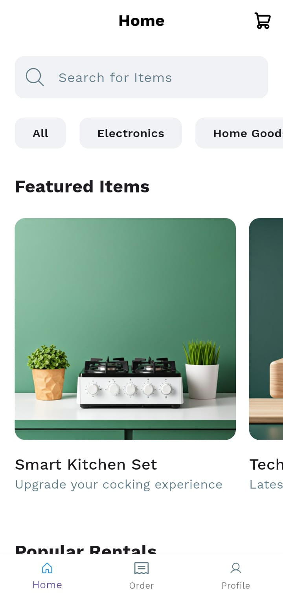
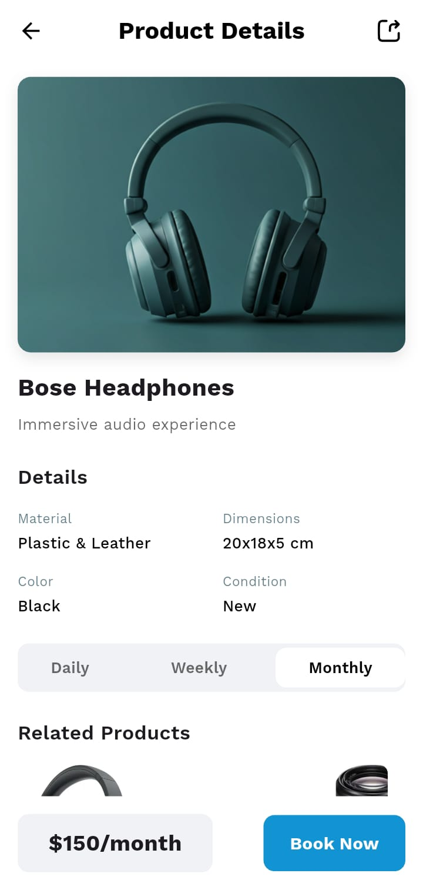
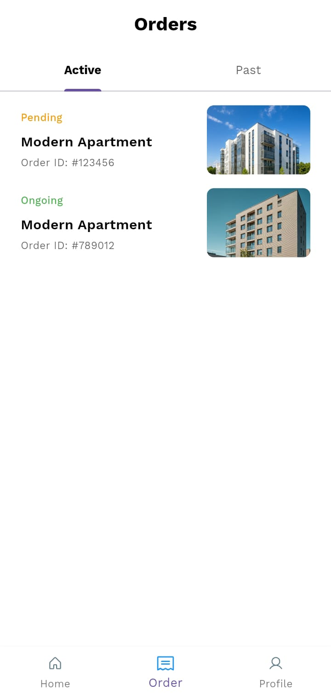
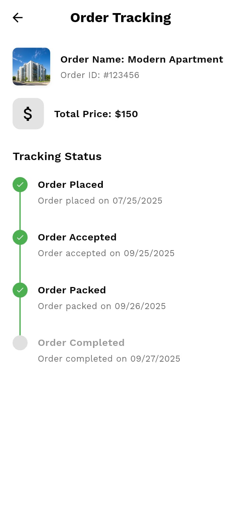

# flutter_assignment

A new Flutter project.


## UI
<table>
  <tr>
    <td align="center">
      
      <br>
      <em>Home Screen</em>
    </td>
    <td align="center">
      
      <br>
      <em>Product Screen</em>
    </td>
    <td align="center">
      
      <br>
      <em>Order Screen</em>
    </td>
    <td align="center">
      
      <br>
      <em>Order Tracking Screen</em>
    </td>
  </tr>
</table>

### Directory Tree Structure
```
project files like pubspec.yaml)📂 flutter_project/
┣━━ 📂 assets/
┃   ┣━━ 📂 icons/
┃   ┗━━ 📂 images/
┣━━ 📂 build/
┣━━ 📂 lib/
┃   ┣━━ 📂 modals/
┃   ┃   ┣━━ 📜 category_modal.dart
┃   ┃   ┣━━ 📜 featured_items_modal.dart
┃   ┃   ┗━━ 📜 product_details_model.dart
┃   ┣━━ 📂 screen/
┃   ┃   ┣━━ 📜 home_screen.dart
┃   ┃   ┣━━ 📜 order_screen.dart
┃   ┃   ┣━━ 📜 order_tracking_screen.dart
┃   ┃   ┣━━ 📜 product_details_screen.dart
┃   ┃   ┗━━ 📜 profile_screen.dart
┃   ┣━━ 📂 widgets/
┃   ┃   ┣━━ 📜 bottom_bar.dart
┃   ┃   ┗━━ 📜 app.dart
┃   ┗━━ 📜 main.dart
┗━━ ... (other project files like pubspec.yaml)
```

#### Getting Started

This project is a starting point for a Flutter application.

A few resources to get you started if this is your first Flutter project:

- [Lab: Write your first Flutter app](https://docs.flutter.dev/get-started/codelab)
- [Cookbook: Useful Flutter samples](https://docs.flutter.dev/cookbook)

For help getting started with Flutter development, view the
[online documentation](https://docs.flutter.dev/), which offers tutorials,
samples, guidance on mobile development, and a full API reference.
